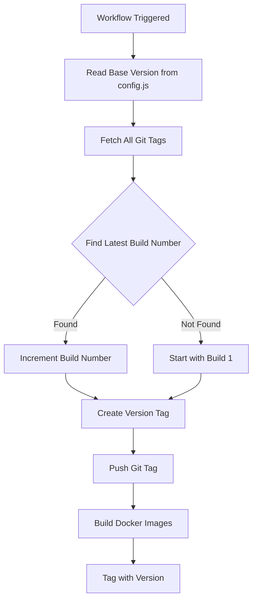

# CI-001: Automatic Version Tagging for Docker Builds

## 📌 Overview

**Type**: CI/CD Enhancement  
**Status**: ✅ Applied  
**Integration Date**: 2025-12-04  
**Upstream Status**: ⏳ Not submitted (fork-specific)

## 🐛 Problem

The previous Docker build workflows required **manual version tag input** for every build:
- Manual input: `tag: 'Docker image tag (e.g., v4.0.0-alpha-1)'`
- Error-prone: Easy to forget incrementing the version
- Inconsistent: No automatic tracking of build numbers
- Time-consuming: Required manual coordination

**Challenges:**
1. Users had to manually specify the version tag each time
2. Risk of duplicate tags or missing build numbers
3. No automatic increment based on git history
4. Version in `config.js` and Docker tags could diverge

## ✅ Solution

Implemented **automatic version tagging** that:
1. Reads the base version from `config/config.js`
2. Scans git tags for existing build numbers
3. Automatically increments the build number
4. Creates and pushes git tags automatically
5. Uses format: `v{base_version}-{build_number}` (e.g., `v4.0.0-alpha-12`)

### How It Works



## 📝 Changes

### Modified Files

#### `.github/workflows/docker-build-push.yml`
- Removed manual `tag` input parameter
- Added `generate-version` job that runs first
- Extracts `PAPERLESS_AI_VERSION` from `config/config.js`
- Automatically increments build number
- Creates and pushes git tag
- All subsequent jobs use the generated version

#### `.github/workflows/docker-ghcr.yml`
- Same changes as docker-build-push.yml
- Ensures consistency across Docker Hub and GHCR

### New Job: `generate-version`

```yaml
generate-version:
  name: Generate Version Tag
  runs-on: ubuntu-latest
  outputs:
    version_tag: ${{ steps.version.outputs.tag }}
    base_version: ${{ steps.version.outputs.base }}
  
  steps:
    - name: Checkout code
      uses: actions/checkout@v4
      with:
        fetch-depth: 0
    
    - name: Generate version tag
      id: version
      run: |
        # Extract base version from config.js
        BASE_VERSION=$(grep "PAPERLESS_AI_VERSION:" config/config.js | sed "s/.*'\(.*\)'.*/\1/")
        
        # Get all tags matching the base version pattern
        git fetch --tags
        LATEST_BUILD=$(git tag -l "v${BASE_VERSION}-*" | sed "s/v${BASE_VERSION}-//" | sort -n | tail -1)
        
        # If no build number found, start with 1
        if [ -z "$LATEST_BUILD" ]; then
          BUILD_NUMBER=1
        else
          BUILD_NUMBER=$((LATEST_BUILD + 1))
        fi
        
        VERSION_TAG="v${BASE_VERSION}-${BUILD_NUMBER}"
        echo "tag=$VERSION_TAG" >> $GITHUB_OUTPUT
        echo "base=$BASE_VERSION" >> $GITHUB_OUTPUT
    
    - name: Create and push tag
      run: |
        VERSION_TAG="${{ steps.version.outputs.tag }}"
        git config user.name "github-actions[bot]"
        git config user.email "github-actions[bot]@users.noreply.github.com"
        git tag -a "$VERSION_TAG" -m "Automated build $VERSION_TAG"
        git push origin "$VERSION_TAG"
```

### Version Format

**Pattern**: `v{base_version}-{build_number}`

**Notes**:
- Pre-release versions are supported (e.g., `v4.0.0-alpha-1`)
- `latest` tags are only applied for stable base versions (no pre-release suffix)

**Examples**:
- `v4.0.0-alpha-1` - First build of version 4.0.0-alpha
- `v4.0.0-alpha-2` - Second build of version 4.0.0-alpha
- `v4.0.0-alpha-15` - Fifteenth build of version 4.0.0-alpha
- `v4.0.0-1` - First build of version 4.0.0 (when config.js is updated)

## 🧪 Testing

### Test Scenarios

**Scenario 1: First build after version change**
```bash
# config.js has PAPERLESS_AI_VERSION: '4.0.0-alpha'
# No existing v4.0.0-alpha-* tags
# Result: v4.0.0-alpha-1
```

**Scenario 2: Subsequent builds**
```bash
# config.js has PAPERLESS_AI_VERSION: '4.0.0-alpha'
# Existing tags: v4.0.0-alpha-1, v4.0.0-alpha-2
# Result: v4.0.0-alpha-3
```

**Scenario 3: Version bump in config.js**
```bash
# config.js updated to PAPERLESS_AI_VERSION: '4.0.0'
# No existing v4.0.0-* tags
# Result: v4.0.0-1
```

### Workflow Triggers

**Automatic trigger on push to main**:
```yaml
on:
  push:
    branches:
      - main
```

**Manual trigger via workflow_dispatch**:
```yaml
on:
  workflow_dispatch:
    inputs:
      also_tag_latest: ...
      build_full_image: ...
```

## 📊 Impact

### Developer Experience

| Aspect | Before | After |
|--------|--------|-------|
| **Version Input** | Manual entry required | Fully automatic |
| **Build Number** | Manual tracking | Auto-increment |
| **Git Tags** | Manual creation | Auto-created |
| **Consistency** | Risk of errors | Always consistent |
| **Time per Build** | ~2-3 minutes | ~30 seconds |

### Version Management

**Benefits**:
- ✅ No manual version input needed
- ✅ Automatic build number tracking
- ✅ Git tags created automatically
- ✅ Version always matches config.js
- ✅ Easy to trace builds in git history
- ✅ Prevents duplicate version tags

**Version Changes**:
```bash
# When base version changes in config.js
v4.0.0-alpha-15  # Last build of 4.0.0-alpha
v4.0.0-1         # First build of 4.0.0 (automatic reset)
v4.0.0-2         # Second build continues
```

## 🎯 Workflow Improvements

### Updated Inputs

**Before**:
```yaml
inputs:
  tag:
    description: 'Docker image tag (e.g., v4.0.0-alpha-1)'
    required: true
    default: 'latest'
```

**After**:
```yaml
inputs:
  also_tag_latest:
    description: 'Also tag as "latest"'
    required: false
    default: false
  build_full_image:
    description: 'Also build Full image (with RAG/PyTorch)'
    required: false
    default: false
```

### Job Dependencies

All jobs now depend on `generate-version`:
```yaml
jobs:
  generate-version: ...
  
  build-lite:
    needs: generate-version
  
  build-full:
    needs: generate-version
  
  push-lite:
    needs: [generate-version, build-lite]
  
  push-full:
    needs: [generate-version, build-full]
  
  summary:
    needs: [generate-version, build-lite, push-lite]
```

## 🔗 Related

- **config/config.js**: Source of truth for base version
- **Docker Hub Workflow**: `.github/workflows/docker-build-push.yml`
- **GHCR Workflow**: `.github/workflows/docker-ghcr.yml`
- **DOCKER-001**: Docker image optimization (image variants)

## 📈 Future Improvements

Potential enhancements:
- [ ] Semantic version bump from commit messages (conventional commits)
- [ ] Automatic changelog generation
- [ ] Version tagging in package.json synchronization
- [ ] Build metadata in Docker image labels
- [ ] Rollback mechanism for failed builds

## 🚀 Usage

### Automatic Build on Push

When pushing to main branch:
```bash
git push origin main
# Workflow automatically:
# 1. Reads version from config.js
# 2. Finds next build number
# 3. Creates tag (e.g., v4.0.0-alpha-12)
# 4. Builds and pushes Docker images
```

### Manual Workflow Dispatch

Via GitHub Actions UI:
1. Go to Actions → "Docker Build and Push"
2. Click "Run workflow"
3. Choose options:
   - Also tag as latest: ✓/✗
   - Build full image: ✓/✗
4. Version is automatically generated

### Updating Base Version

To release a new version:
1. Update `config/config.js`:
   ```javascript
   PAPERLESS_AI_VERSION: '4.0.0',
   ```
2. Commit and push
3. Next build will be `v4.0.0-1`

## 📸 Example Output

**GitHub Actions Summary**:
```
🚀 Docker Build Summary

Version Tag: `v4.0.0-alpha-12`
Base Version: `4.0.0-alpha`
Also tagged as latest: true

✅ Lite Image (Default)
- Size: ~500-700 MB
- Platforms: linux/amd64, linux/arm64
- Features: Full AI tagging, no RAG

docker pull admonstrator/paperless-ai-patched:v4.0.0-alpha-12
```

**Git Tags**:
```bash
$ git tag -l "v4.0.0-alpha-*"
v4.0.0-alpha-1
v4.0.0-alpha-2
v4.0.0-alpha-3
...
v4.0.0-alpha-12
```

## 👥 Credits

- **Implementation**: Admonstrator with GitHub Copilot
- **Rationale**: Simplify build process and ensure version consistency
- **Inspiration**: Best practices from enterprise CI/CD pipelines
