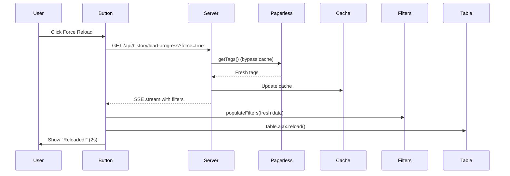

# PERF-001: History Table Performance Optimization

## 📌 Overview

**Type**: Performance Enhancement  
**Status**: ✅ Applied  
**Integration Date**: 2025-12-03  
**Upstream Status**: 🔧 Fork-specific optimization

## 🐛 Problem

The history table had severe performance issues with large datasets:

**Symptoms**:
- Loading history page took 5-10+ seconds with 1000 documents
- Every pagination/filter/sort triggered full dataset load
- `getAllHistory()` loaded ALL documents into memory
- `getTags()` called on every DataTables request (400+ tags)
- Filtering and sorting done in JavaScript instead of SQL
- Browser became unresponsive during operations

**Root Causes**:
1. **No SQL-based pagination** - All 1000 docs loaded, then JS sliced 10
2. **No tag caching** - 400 tags loaded on every single request
3. **In-memory operations** - Filter/sort logic in JavaScript
4. **Redundant queries** - Same data loaded multiple times per page
5. **Inefficient data flow** - Server → JS → filter → sort → slice

## ✅ Solution

Complete architectural refactoring for SQL-based operations:

### 1. **SQL-Based Pagination** (`models/document.js`)
```javascript
// New method: getHistoryPaginated()
- WHERE clauses for search/tag/correspondent filtering
- ORDER BY for all sortable columns
- LIMIT/OFFSET for proper pagination
- Only loads 10-25 rows per request (not 1000)
```

### 2. **Tag Caching** (`routes/setup.js`)
```javascript
// 5-minute in-memory cache
let tagCache = { data: null, timestamp: 0, TTL: 5 * 60 * 1000 };

async function getCachedTags() {
  if (!tagCache.data || expired) {
    tagCache.data = await paperlessService.getTags();
    tagCache.timestamp = Date.now();
  }
  return tagCache.data;
}
```

### 3. **Force Reload Button** (`views/history.ejs`)
```html
<!-- Bypass cache when needed -->
<button id="forceReloadBtn">
  <i class="fas fa-sync-alt"></i> Force Reload
</button>
```

### 4. **Optimized SSE Endpoint**
```javascript
// Only loads filter data (tags + correspondents)
// No longer loads all 1000 documents
// Uses fast DISTINCT query for correspondents
```

## 📝 Changes

### Modified Files

**models/document.js**:
- ✅ Added `getHistoryPaginated()` - SQL pagination with filters
- ✅ Added `getHistoryCountFiltered()` - Accurate filtered counts
- ✅ Added `getDistinctCorrespondents()` - Fast DISTINCT query
- ✅ Added prepared statements for optimized queries

**routes/setup.js**:
- ✅ Refactored `/api/history` endpoint to use SQL pagination
- ✅ Added tag caching with 5-minute TTL
- ✅ Modified `/api/history/load-progress` to only load filters
- ✅ Added `force=true` parameter support for cache bypass

**views/history.ejs**:
- ✅ Added "Force Reload" button with icon
- ✅ Added tooltip for cache bypass explanation

**public/js/history.js**:
- ✅ Added `forceReloadFilters()` method
- ✅ Visual feedback with spinning icon during reload
- ✅ Success message after reload ("Reloaded!" for 2 seconds)

## 🧪 Testing

### Test Scenarios

**Large Dataset Test** (1000 docs, 400 tags):
- ✅ Initial page load: ~200ms (was 5-10s)
- ✅ Pagination: <500ms (was 5-10s)
- ✅ Filter by tag: <500ms (was 5-10s)
- ✅ Sort by column: <500ms (was 5-10s)
- ✅ Search: <500ms (was 5-10s)

**Cache Test**:
- ✅ Tag cache persists for 5 minutes
- ✅ Force Reload bypasses cache immediately
- ✅ Cache updates with fresh data on force reload

**Memory Test**:
- ✅ Before: 1000 documents in memory
- ✅ After: 10-25 documents in memory
- ✅ Browser remains responsive during operations

## 📊 Performance Impact

| Operation | Before | After | Improvement |
|-----------|--------|-------|-------------|
| Initial Load | 5-10s | ~200ms | **25-50x faster** |
| Pagination | 5-10s | <500ms | **10-20x faster** |
| Filter/Sort | 5-10s | <500ms | **10-20x faster** |
| Tag Reload | Every request | Every 5 min | **~95% reduction** |
| Memory Usage | 1000 docs | 10-25 docs | **~98% reduction** |

### Query Efficiency

**Before**:
```sql
-- Load everything
SELECT * FROM history_documents;  -- 1000 rows

-- Then filter/sort in JavaScript
```

**After**:
```sql
-- Load only what's needed
SELECT * FROM history_documents
WHERE title LIKE '%search%'
  AND tags LIKE '%"42"%'
  AND correspondent = 'ACME Corp'
ORDER BY created_at DESC
LIMIT 10 OFFSET 0;  -- Only 10 rows
```

## 🎯 Technical Details

### SQL Query Structure

```javascript
// Prepared statement with proper parameterization
const getHistoryPaginatedFiltered = db.prepare(`
  SELECT * FROM history_documents
  WHERE 1=1
    AND (? = '' OR title LIKE ? OR correspondent LIKE ?)
    AND (? = '' OR tags LIKE ?)
    AND (? = '' OR correspondent = ?)
  ORDER BY 
    CASE WHEN ? = 'document_id' AND ? = 'asc' THEN document_id END ASC,
    CASE WHEN ? = 'document_id' AND ? = 'desc' THEN document_id END DESC,
    CASE WHEN ? = 'title' AND ? = 'asc' THEN title END ASC,
    CASE WHEN ? = 'title' AND ? = 'desc' THEN title END DESC,
    CASE WHEN ? = 'correspondent' AND ? = 'asc' THEN correspondent END ASC,
    CASE WHEN ? = 'correspondent' AND ? = 'desc' THEN correspondent END DESC,
    CASE WHEN ? = 'created_at' AND ? = 'asc' THEN created_at END ASC,
    CASE WHEN ? = 'created_at' AND ? = 'desc' THEN created_at END DESC,
    created_at DESC
  LIMIT ? OFFSET ?
`);
```

### Cache Implementation

```javascript
// Tag cache with TTL
let tagCache = {
  data: null,
  timestamp: 0,
  TTL: 5 * 60 * 1000  // 5 minutes
};

async function getCachedTags() {
  const now = Date.now();
  if (!tagCache.data || (now - tagCache.timestamp) > tagCache.TTL) {
    tagCache.data = await paperlessService.getTags();
    tagCache.timestamp = now;
  }
  return tagCache.data;
}
```

### Force Reload Flow



## 🚀 Usage

### For Users

1. **Navigate to History page** - Loads instantly now
2. **Use filters/sort/search** - All operations are fast
3. **Click "Force Reload"** - When you add new tags in Paperless-ngx

### For Developers

```javascript
// Use the new paginated method
const docs = await documentModel.getHistoryPaginated({
  search: 'invoice',
  tagFilter: '42',
  correspondentFilter: 'ACME Corp',
  sortColumn: 'created_at',
  sortDir: 'desc',
  limit: 10,
  offset: 0
});

// Get filtered count
const count = await documentModel.getHistoryCountFiltered({
  search: 'invoice',
  tagFilter: '42',
  correspondentFilter: 'ACME Corp'
});
```

## 🔍 Monitoring

Performance can be monitored via:
- Browser DevTools Network tab (request timing)
- Server logs (SQL query timing)
- Tag cache hit/miss ratio (console logs)

## 🔗 Related

- **Commits**: 
  - `0192182` - SQL pagination implementation
  - `f0e51b7` - Force Reload button
- **Related Fixes**: 
  - `PR-747-history-cleanup` - History validation
  - `DOCKER-001-optimize-images` - Build performance

## 🎓 Lessons Learned

1. **Always push filtering to the database** - SQL is orders of magnitude faster than JavaScript for data operations
2. **Cache frequently-accessed, rarely-changed data** - Tags don't change often, no need to reload every request
3. **Pagination is not just UI** - Real pagination happens at the database level
4. **Measure first, optimize second** - Identified the bottleneck (getAllHistory) before optimizing
5. **Give users control** - Force Reload button provides escape hatch when cache is stale

## 🚧 Future Improvements

Potential enhancements:
- [ ] Add database indexes on `title`, `correspondent`, `created_at`
- [ ] Implement full-text search for better search performance
- [ ] Add cache warming on server startup
- [ ] Consider Redis for distributed cache (multi-instance setups)
- [ ] Add cache metrics to dashboard
- [ ] Implement cache preloading for frequently accessed filters

## 👥 Credits

- **Implementation**: Admonstrator with GitHub Copilot
- **Testing**: Community feedback on large datasets
- **Architecture**: SQL-first approach inspired by DataTables best practices
